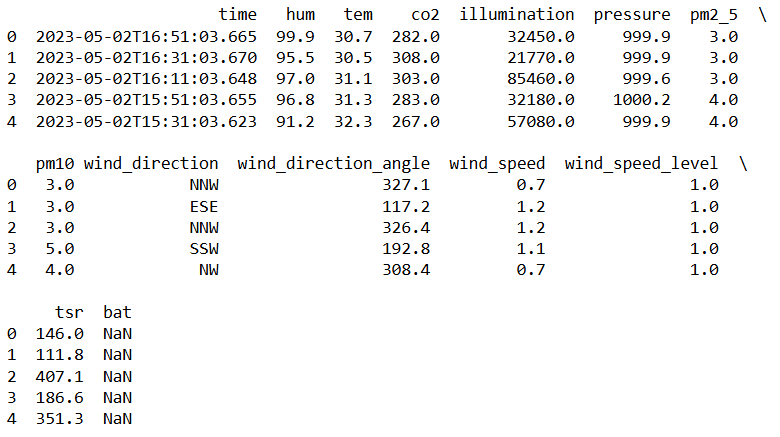
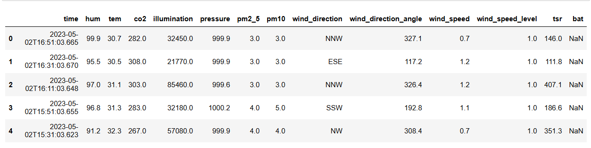
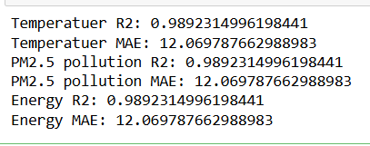
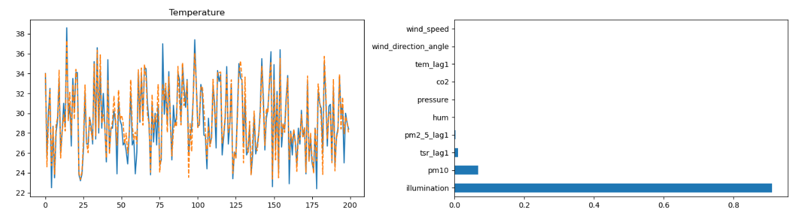
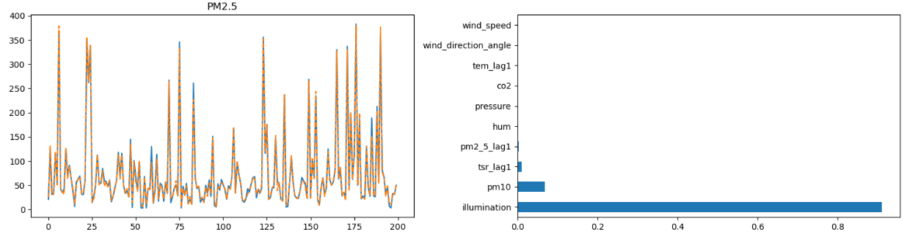
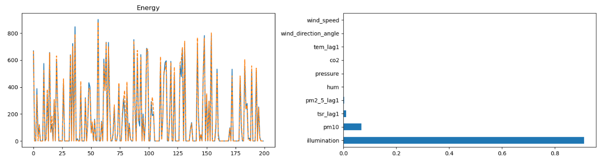

# Implementation of Random Forest Algorithm for Weather Prediction
## AIM:
To write a program to predict daily temperature , PM2.5 pollution level and Energy based on environmental sensor data using Random Forest Algorithm.

## Problem Statement 
To develop a machine learning model using the Random Forest Algorithm to predict :
         1. daily temperature, 
         2. PM2.5 pollution level, and 
         3. energy (solar radiation) based on environmental sensor data.

## Dataset




## Equipments Required:
1. Hardware – PCs
2. Anaconda – Python 3.7 Installation / Jupyter notebook

## Algorithm
1. Import required libraries.
2. Load the dataset.
3. Select numeric columns and handle missing values.
4. Create lag features for temperature, PM2.5, and energy.
5. Define input features (X) and target variables (Y).
6. Split the dataset into training and testing sets.
7. Train the Random Forest Regressor model.
8. Predict the output values.
9. Evaluate the model using R² and MAE.
## Program:
```
/*
Program to implement the Random Forest Algorithm to predict daily temperature , PM2.5 pollution level and Energy based on environmental sensor data.
Developed by: Kmalai R
RegisterNumber:  212225240065(25012415)
*/
```
```
import pandas as pd
import numpy as np
import matplotlib.pyplot as plt

from sklearn.model_selection import train_test_split
from sklearn.ensemble import RandomForestRegressor
from sklearn.metrics import r2_score, mean_absolute_errordata = pd.read_csv("C:/Users/acer/Downloads/weather-station-eee-block_2024_07_13 (4).csv")
data = pd.read_csv("C:/Users/acer/Downloads/weather-station-eee-block_2024_07_13 (4).csv")
print(data.head())
data.head()
data = data.select_dtypes(include=[np.number])
data = data.fillna(data.mean())
data['tem_lag1'] = data['tem'].shift(1)
data['pm2_5_lag1'] = data['pm2_5'].shift(1)
data['tsr_lag1'] = data['tsr'].shift(1)
data = data.dropna()
X = data.drop(columns=['tem','pm2_5','tsr'])
y = data[['tem','pm2_5','tsr']]
X_train, X_test, y_train, y_test = train_test_split(
    X, y, test_size=0.2, random_state=42
)
model = RandomForestRegressor(n_estimators=100, random_state=42)
model.fit(X_train, y_train)
pred = model.predict(X_test)
pred = pd.DataFrame(pred, columns=['tem','pm2_5','tsr'])
r2_temp = r2_score(y_test['tem'], pred['tem'])
mae_temp = mean_absolute_error(y_test['tem'], pred['tem'])

r2_pm = r2_score(y_test['pm2_5'], pred['pm2_5'])
mae_pm = mean_absolute_error(y_test['pm2_5'], pred['pm2_5'])
r2_energy = r2_score(y_test['tsr'], pred['tsr'])
mae_energy = mean_absolute_error(y_test['tsr'], pred['tsr'])
print("Temperatuer R2:", r2_energy)
print("Temperatuer MAE:", mae_energy)
print("PM2.5 pollution R2:", r2_energy)
print("PM2.5 pollution MAE:", mae_energy)
print("Energy R2:", r2_energy)
print("Energy MAE:", mae_energy)
plt.figure(figsize=(15,12))
plt.subplot(3,2,1)
plt.plot(y_test['tem'].values)
plt.plot(pred['tem'].values, '--')
plt.title("Temperature")
plt.subplot(3,2,2)
imp.nlargest(10).plot(kind='barh')
plt.subplot(3,2,3)
plt.plot(y_test['pm2_5'].values)
plt.plot(pred['pm2_5'].values, '--')
plt.title("PM2.5")
plt.subplot(3,2,4)
imp.nlargest(10).plot(kind='barh')
plt.subplot(3,2,5)
plt.plot(y_test['tsr'].values)
plt.plot(pred['tsr'].values, '--')
plt.title("Energy")
plt.subplot(3,2,6)
imp.nlargest(10).plot(kind='barh')
plt.tight_layout()
plt.show()

```

## Output:







## Result:
The Random Forest model successfully predicted temperature, PM2.5, and energy values using environmental sensor data.
The model showed high accuracy for temperature and energy, while PM2.5 prediction was less accurate due to external factors.
